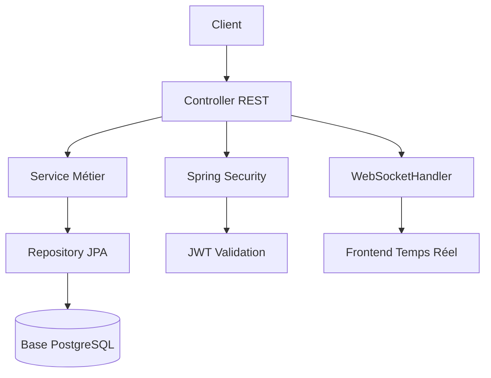
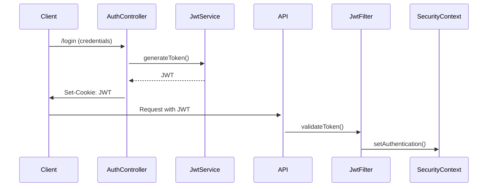

# internship-management-backend

## 📚 Documentation du Projet

### 🏛️ Architecture
Application Spring Boot 3.3.11 avec :



- **Couches principales** :
  - Contrôleurs REST (`@RestController`)
  - Services métier (`@Service`)
  - Repositories Spring Data (`@Repository`)
  - Entités JPA (`@Entity`)
- **Flux sécurisé** : Validation JWT → Rôles utilisateur → Autorisations
- **WebSocket** : Configuration via `@EnableWebSocket` + `WebSocketHandler`

### 🏷️ Conventions de Nommage

| Type                | Convention                          | Exemple réel                 |
|---------------------|-------------------------------------|------------------------------|
| **Packages**        | `com.projects.internship.[couche].[module]` | `com.projects.internship.security.jwt` |
| **DTO**             | Suffixe `DTO` + `Data`             | `InternshipDetailsDTO`       |
| **Entités**         | Suffixe `Entity`                   | `UserEntity.java`            |
| **Contrôleurs**     | Suffixe `Controller`               | `ReportController.java`      |
| **Services**        | Suffixe `Service`                  | `InternshipService.java`     |
| **Exceptions**      | Suffixe `Exception`                | `InvalidJwtException.java`   |

### 🔄 Flux d'Ajout de Fonctionnalité

1. **Entité JPA**
   - Créer classe `@Entity`
   - Ajouter validation (`@NotBlank`, `@Size`)
   - Configurer relations (`@OneToMany`, etc.)

2. **Repository**
   - Interface `extends JpaRepository<Entity, Long>`
   - Ajouter méthodes de recherche personnalisées

3. **Service Métier**
   - Implémenter logique métier
   - Gestion des exceptions (`try/catch`)
   - Journalisation (`@Slf4j`)

4. **DTO**
   - Créer classe avec validation
   - Mapper Entité↔DTO (`ModelMapper`)
   - Versionning DTO (`v1`, `v2`)

5. **Controller REST**
   - Annotations `@RestController` + `@RequestMapping`
   - Gestion des erreurs (`@ExceptionHandler`)
   - Documentation Swagger (`@Operation`)

6. **Sécurité**
   - Configurer accès via `SecurityConfig`
   - Ajouter rôles (`ROLE_ADMIN`, etc.)
   - Tests Postman + tests d'intégration


### 🏷️ Versioning
- Version actuelle : 0.0.1-SNAPSHOT
- JDK 21 requis

### 🚀 Fonctionnalités Détaillées

#### 🔐 Authentification JWT
**Flux d'authentification** :

**Classes clés** :
- `JwtFilter` (filtre Spring Security)
- `JwtService` (génération/vérification des tokens)
- `UserDetailsServiceImpl` (chargement des utilisateurs)

#### 🌐 WebSocket
**Configuration** :
```java
@Configuration
@EnableWebSocket
public class WebSocketConfig implements WebSocketConfigurer {
    @Override
    public void registerWebSocketHandlers(WebSocketHandlerRegistry registry) {
        registry.addHandler(myHandler(), "/ws").setAllowedOrigins("*");
    }
}
```
**Bonnes pratiques** :
- Utiliser STOMP pour le messaging
- Configurer les origines CORS
- Implémenter `WebSocketHandler` pour le traitement

#### 📄 Génération PDF
**Workflow** :
1. Service métier génère les données
2. Appel à `PdfGeneratorService.generatePdf()`
3. Stockage temporaire dans `/tmp`
4. Envoi au client via `ResourceHttpRequestHandler`

#### ✅ Validation des Données
**Exemple d'entité** :
```java
@Entity
public class InternshipEntity {
    @NotBlank(message = "Le titre est obligatoire")
    @Size(max = 100)
    private String title;
    
    @FutureOrPresent
    private LocalDate startDate;
}
```

#### ⚙️ Points d'Extension
| Composant          | Extension possible                 |
|---------------------|-------------------------------------|
| `JwtFilter`         | Ajouter des claims personnalisés    |
| `WebSocketHandler`  | Intercepteurs de messages           |
| `PdfGenerator`      | Support de templates HTML/CSS       |

### ▶️ Démarrage
```bash
mvn spring-boot:run
```

Accéder à la documentation : http://localhost:8080/swagger-ui.html
