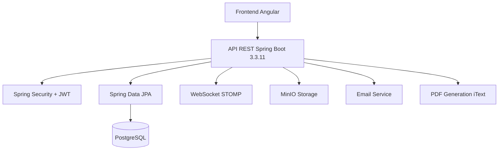

# 🎓 Système de Gestion de Stages - Documentation Fonctionnelle

## 🎯 Objectif

Plateforme de gestion complète des stages académiques permettant aux étudiants de postuler aux offres, aux entreprises de publier des opportunités, et aux enseignants de superviser le processus. Le système facilite la communication entre tous les acteurs via un chat temps réel et génère automatiquement les conventions de stage.

## 🚀 Démarrage rapide

### Prérequis

- Java 17 ou supérieur
- Maven 3.6.3 ou supérieur
- PostgreSQL 13 ou supérieur
- Node.js 16+ et npm (pour la partie frontend)

### Configuration

1. **Cloner le dépôt**
   ```bash
   git clone [URL_DU_DEPOT]
   cd internship-management-backend
   ```

2. **Configurer la base de données**
   - Créer une base de données PostgreSQL
   - Copier le fichier `env.template` vers `.env`
   - Mettre à jour les variables d'environnement dans `.env` avec vos paramètres de base de données

3. **Construire le projet**
   ```bash
   mvn clean install
   ```

4. **Lancer l'application**
   ```bash
   mvn spring-boot:run
   ```

5. **Accéder à l'application**
   - L'API sera disponible sur : `http://localhost:8080`
   - La documentation Swagger sera accessible sur : `http://localhost:8080/swagger-ui.html`

### Démarrage avec Docker (optionnel)

1. **Construire l'image Docker**
   ```bash
   docker-compose build
   ```

2. **Démarrer les conteneurs**
   ```bash
   docker-compose up -d
   ```


## 🏗️ Principes Clés

### 👥 Gestion Multi-Rôles
- **Étudiants** : Consultation et candidature aux offres de stage
- **Entreprises** : Publication et gestion des offres, sélection des candidats
- **Enseignants** : Supervision et validation des stages
- **Administrateurs** : Gestion globale de la plateforme

### 📝 Workflow de Stage
- **Publication** : Entreprise crée une offre avec compétences requises
- **Candidature** : Étudiant postule avec CV et lettre de motivation
- **Sélection** : Entreprise accepte/refuse les candidatures
- **Convention** : Génération automatique PDF des documents légaux

### 💬 Communication Temps Réel
- **WebSocket** : Chat instantané entre tous les acteurs
- **Notifications** : Alertes email et in-app pour les événements importants
- **Historique** : Traçabilité complète des échanges

### 📁 Gestion Documentaire
- **Stockage MinIO** : Documents sécurisés (CV, lettres, conventions)
- **Génération PDF** : Conventions automatiques avec iText
- **Validation** : Contrôle des formats et tailles de fichiers

## 💻 Interfaces Utilisateur

### 🎓 Interface Étudiant
- **Tableau de bord** : Offres disponibles avec filtres par secteur/compétences
- **Candidatures** : Suivi des postulations (en attente, acceptées, refusées)
- **Documents** : Upload CV/lettre de motivation
- **Chat** : Communication avec entreprises et enseignants

### 🏢 Interface Entreprise
- **Gestion des offres** : CRUD complet des offres de stage
- **Candidatures reçues** : Liste des postulants avec documents
- **Sélection** : Acceptation/refus des candidatures
- **Communication** : Chat avec étudiants et enseignants

### 👨🏫 Interface Enseignant
- **Supervision** : Vue d'ensemble des stages de ses étudiants
- **Validation** : Approbation des conventions de stage
- **Suivi** : Évaluation et notes des stages
- **Communication** : Chat avec étudiants et entreprises

### ⚙️ Interface Administrateur
- **Gestion utilisateurs** : CRUD des comptes (étudiants, entreprises, enseignants)
- **Secteurs** : Configuration des domaines d'activité
- **Statistiques** : Métriques sur les stages et candidatures
- **Configuration** : Paramètres système et notifications

## 🧾 Règles de Décision

### 🔄 Gestion des Statuts
- **Offres** : ACTIVE, INACTIVE, EXPIRED
- **Candidatures** : PENDING, ACCEPTED, REJECTED
- **Conventions** : DRAFT, SIGNED, COMPLETED, CANCELLED

### ✅ Règles Métier
- Un étudiant ne peut postuler qu'une fois par offre
- Les documents (CV, lettre) sont obligatoires pour candidater
- Seule l'entreprise peut accepter/refuser une candidature
- Un enseignant doit valider chaque convention de stage
- Les notifications sont envoyées automatiquement à chaque étape

## 🔑 Permissions

### 🔐 Matrice de Sécurité
| Fonctionnalité | STUDENT | COMPANY | TEACHER | ADMIN |
|----------------|---------|---------|---------|-------|
| **Voir offres** | ✅ | ✅ | ✅ | ✅ |
| **Créer offres** | ❌ | ✅ | ❌ | ✅ |
| **Postuler** | ✅ | ❌ | ❌ | ❌ |
| **Sélectionner candidats** | ❌ | ✅ | ❌ | ✅ |
| **Valider conventions** | ❌ | ❌ | ✅ | ✅ |
| **Gérer utilisateurs** | ❌ | ❌ | ❌ | ✅ |

## 📌 User Stories

### 🎓 Étudiant
- **US-001** : Consulter les offres de stage par secteur et compétences
- **US-002** : Postuler à une offre avec CV et lettre de motivation
- **US-003** : Suivre le statut de mes candidatures
- **US-004** : Communiquer avec l'entreprise via chat

### 🏢 Entreprise
- **US-005** : Publier une offre de stage avec critères spécifiques
- **US-006** : Consulter les candidatures reçues avec documents
- **US-007** : Accepter/refuser les candidatures
- **US-008** : Échanger avec les étudiants et enseignants

### 👨🏫 Enseignant
- **US-009** : Superviser les stages de mes étudiants
- **US-010** : Valider les conventions de stage
- **US-011** : Évaluer les performances des stagiaires
- **US-012** : Communiquer avec entreprises et étudiants

### ⚙️ Administrateur
- **US-013** : Gérer les comptes utilisateurs (CRUD)
- **US-014** : Configurer les secteurs d'activité
- **US-015** : Consulter les statistiques de la plateforme
- **US-016** : Paramétrer les notifications système

## 📈 Roadmap

### 🎯 Version 0.1.0 (Actuelle) - Fonctionnalités de Base
- ✅ Authentification multi-rôles
- ✅ Gestion des offres de stage
- ✅ Système de candidatures
- ✅ Chat temps réel
- ✅ Génération de conventions PDF
- ✅ Stockage de documents

### 🚀 Version 0.2.0 (Q2 2025) - Améliorations
- 🔄 Notifications push temps réel
- 🔄 Système d'évaluation des stages
- 🔄 Tableau de bord analytique
- 🔄 Export Excel des données

### 🌟 Version 1.0.0 (Q3 2025) - Fonctionnalités Avancées
- 📊 Intelligence artificielle pour matching étudiant-offre
- 🔗 Intégration calendrier pour suivi des stages
- 📱 Application mobile
- 🌐 Multi-langue (FR/EN)

---

*Version 0.0.1-SNAPSHOT - Documentation Fonctionnelle*


# 🎓 Système de Gestion de Stages - Documentation Technique

## 🏛️ Architecture

Application Spring Boot 3.3.11 avec architecture en couches :



### 🏷️ Conventions de Nommage
- **Packages** : `com._projects.internship.[couche].[module]`
- **Entités** : Suffixe implicite (User, InternshipOffer, Application)
- **Contrôleurs** : Suffixe `Controller`
- **Services** : Suffixe `Service` + `ServiceImpl`
- **DTO** : Suffixe `DTO` ou `Request`/`Response`

## 📊 Modèle de Données

### 👤 User (Utilisateur)
```java
@Entity
@Table(name = "_user")
public class User implements UserDetails {
    @Id private Long id;
    @NotBlank private String username;
    @NotBlank private String password;
    @Email private String email;
    @NotBlank private String firstName;
    @NotBlank private String lastName;
    @ManyToOne private Sector sector;
    @Enumerated(EnumType.STRING) private Role role;
}
```

### 🏢 InternshipOffer (Offre de Stage)
```java
@Entity
public class InternshipOffer {
    @Id private Long id;
    @Column(length = 1024) private String title;
    @Column(columnDefinition = "TEXT") private String description;
    @ManyToOne private Sector sector;
    @ElementCollection private List<String> skills;
    @Column(length = 1024) private String location;
    private OfferStatus status = OfferStatus.ACTIVE;
    private Integer length;
    @ManyToOne private User company;
    private LocalDateTime createdAt;
}
```

### 📋 Application (Candidature)
```java
@Entity
@Table(name = "application")
public class Application {
    @Id private Long id;
    @ManyToOne private User student;
    @ManyToOne private InternshipOffer offer;
    @Column(nullable = false) private String cvPath;
    @Column(nullable = false) private String coverLetterPath;
    @Enumerated(EnumType.STRING) private ApplicationStatus status;
    private LocalDateTime applicationDate;
}
```

### 📄 Convention (Convention de Stage)
```java
@Entity
public class Convention {
    @Id private Long id;
    @OneToOne private Application application;
    @ManyToOne private User teacher;
    private LocalDateTime startDate;
    private LocalDateTime endDate;
    @Enumerated(EnumType.STRING) private ConventionStatus status;
    private String pdfPath;
    private LocalDateTime createdAt;
}
```

### 💬 ChatMessage (Message de Chat)
```java
@Entity
public class ChatMessageEntity {
    @Id private Long id;
    @ManyToOne private User sender;
    @ManyToOne private User receiver;
    private String content;
    private LocalDateTime timestamp;
    private Boolean isRead = false;
}
```

### 🔔 Notification
```java
@Entity
public class Notification {
    @Id private Long id;
    private String title;
    private String message;
    @Enumerated(EnumType.STRING) private NotificationType type;
    @Enumerated(EnumType.STRING) private NotificationChannel channel;
    private LocalDateTime createdAt;
    private String targetUserId;
}
```

## 🔧 Services Principaux

### 📝 Logique Métier
```java
@Service
public class ApplicationService {
    public void processApplication(ApplicationRequestDTO request) {
        // Vérification : un étudiant ne peut postuler qu'une fois par offre
        if (applicationExists(request.getStudentId(), request.getOfferId())) {
            throw new DuplicateApplicationException();
        }
        
        // Validation des documents requis
        validateDocuments(request.getCvPath(), request.getCoverLetterPath());
        
        // Création de la candidature
        Application application = createApplication(request);
        
        // Notification à l'entreprise
        notificationService.notifyCompany(application);
    }
}
```

### 🏢 Services Core
```java
@Service
public class InternshipOfferService {
    public List<InternshipOffer> findByFilters(String sector, List<String> skills);
    public InternshipOffer createOffer(CreateInternshipOfferRequestDTO request);
    public void updateOfferStatus(Long offerId, OfferStatus status);
}

@Service
public class ConventionPdfGenerationService {
    public String generateConventionPdf(Convention convention);
    public byte[] downloadConvention(Long conventionId);
}

@Service
public class ChatMessageService {
    public void sendMessage(Long senderId, Long receiverId, String content);
    public List<ChatMessage> getChatHistory(Long user1Id, Long user2Id);
}
```

## 🔐 Configuration Sécurité

### 🛡️ Spring Security + JWT
```java
@Configuration
@EnableWebSecurity
public class SecurityConfig {
    @Bean
    public SecurityFilterChain filterChain(HttpSecurity http) {
        return http
            .authorizeHttpRequests(auth -> auth
                .requestMatchers("/api/v1/auth/**").permitAll()
                .requestMatchers("/api/v1/offers/**").hasAnyRole("STUDENT", "COMPANY", "TEACHER", "ADMIN")
                .requestMatchers("/api/v1/admin/**").hasRole("ADMIN")
                .anyRequest().authenticated())
            .addFilterBefore(jwtAuthFilter, UsernamePasswordAuthenticationFilter.class)
            .build();
    }
}
```

### 🔑 Rôles et Permissions
```java
public enum Role {
    STUDENT,    // Consultation offres, candidatures
    COMPANY,    // Gestion offres, sélection candidats
    TEACHER,    // Supervision, validation conventions
    ADMIN       // Gestion complète système
}
```

## 🌐 Configuration WebSocket

### 💬 Chat Temps Réel
```java
@Configuration
@EnableWebSocket
public class WebSocketConfig implements WebSocketConfigurer {
    @Override
    public void registerWebSocketHandlers(WebSocketHandlerRegistry registry) {
        registry.addHandler(chatHandler(), "/ws/chat")
                .setAllowedOrigins("*")
                .addInterceptors(new WebSocketAuthInterceptor());
    }
}
```

## 📁 Stockage et Documents

### 🗄️ Configuration MinIO
```java
@Configuration
public class MinIoConfig {
    @Value("${minio.url}")
    private String minioUrl;
    
    @Value("${minio.access-key}")
    private String accessKey;
    
    @Value("${minio.secret-key}")
    private String secretKey;
    
    @Bean
    public MinioClient minioClient() {
        return MinioClient.builder()
                .endpoint(minioUrl)
                .credentials(accessKey, secretKey)
                .build();
    }
}
```

### 📄 Génération PDF
```java
@Service
public class ConventionPdfGenerationService {
    public String generateConventionPdf(Convention convention) {
        Document document = new Document();
        PdfWriter.getInstance(document, new FileOutputStream(pdfPath));
        document.open();
        // Génération du contenu PDF
        document.close();
        return pdfPath;
    }
}
```

## 📧 Configuration Email

### 📮 Service de Notification
```java
@Service
public class EmailServiceImpl implements EmailService {
    @Autowired
    private JavaMailSender mailSender;
    
    @Override
    public void sendNotificationEmail(String to, String subject, String content) {
        SimpleMailMessage message = new SimpleMailMessage();
        message.setTo(to);
        message.setSubject(subject);
        message.setText(content);
        mailSender.send(message);
    }
}
```

## ⚙️ Configuration Application

### 🔧 application.properties
```properties
# Database
spring.datasource.url=${DATABASE_URL}
spring.datasource.username=${DATABASE_USERNAME}
spring.datasource.password=${DATABASE_PASSWORD}
spring.jpa.hibernate.ddl-auto=update

# JWT
application.security.jwt.secret-key=${JWT_SECRET_KEY}
application.security.jwt.expiration=86400000

# MinIO
minio.url=${MINIO_API_URL}
minio.access-key=${MINIO_USERNAME}
minio.secret-key=${MINIO_PASSWORD}

# Email
spring.mail.host=${MAIL_HOST}
spring.mail.port=${MAIL_PORT}
spring.mail.username=${MAIL_USERNAME}
spring.mail.password=${MAIL_PASSWORD}
```

## 🏗️ Structure du Projet

```
src/main/java/com/_projects/internship/
├── config/                 # Configurations (Security, WebSocket, MinIO)
├── controller/            # Contrôleurs REST
│   ├── auth/             # Authentification
│   ├── core/             # Fonctionnalités principales
│   └── chat/             # Chat temps réel
├── dto/                  # Data Transfer Objects
├── model/                # Entités JPA
│   ├── core/            # Entités métier
│   ├── security/        # User, Role
│   └── notification/    # Notifications
├── repository/           # Repositories Spring Data
├── service/              # Services métier
└── exceptions/           # Gestion des erreurs
```

## 🔍 Points Techniques

### ⚠️ Défis Techniques
- **Performance** : Upload de gros fichiers PDF/documents
- **Sécurité** : Protection des données personnelles étudiants
- **Disponibilité** : Charge importante en période de candidatures
- **Intégrité** : Cohérence des données entre candidatures et conventions

### 🛡️ Solutions Implémentées
- **Limitation** : Taille max fichiers (5MB) + validation formats
- **Chiffrement** : Données sensibles + HTTPS obligatoire
- **Cache** : Sessions utilisateur + pagination des résultats
- **Transactions** : @Transactional sur opérations critiques

### 🚀 Optimisations
- **Lazy Loading** : Relations JPA optimisées
- **Connection Pooling** : HikariCP pour PostgreSQL
- **Indexation** : Index sur colonnes fréquemment requêtées
- **Compression** : Gzip pour les réponses API
- **Indexation** : Index sur colonnes fréquemment requêtées

---

*Version 0.0.1-SNAPSHOT - Spring Boot 3.3.11 - JDK 21 - Documentation Technique*